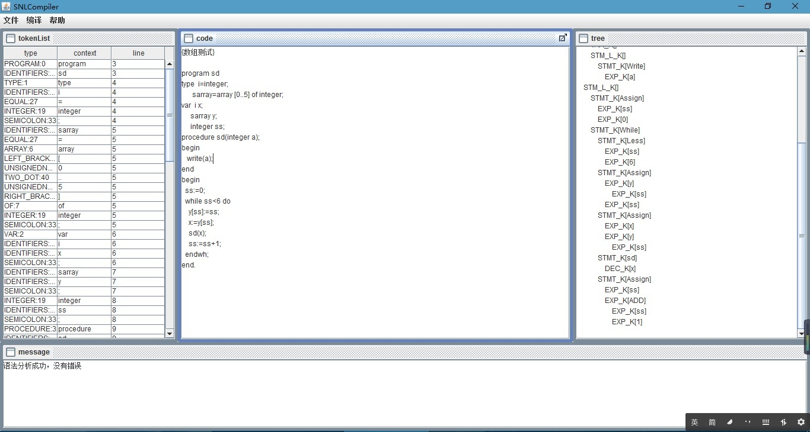

liziyi
# SNL-Compiler
***
1. 简介
2. SNL词法分析器
3. SNL语法分析器
4. Client
***
## 项目介绍
[SNLCompiler](http://www.github.com/hekind/SNL-Compiler "SNLCompiler")  
本程序是编译原理实验课的课程设计。 针对的SNL语言的编译器，再这里，只实现了词法分析器和语法分析器。  
> SNL(Small Nested Language)语言是我们自行定义的教学模型语言，它是一种类PASCAl的“级”程序设计语言。我们需要编写关于SNL语言的词法分析器和语法分析器。  

程序结构如下：  
1. cn.hekind.client  
采用Swing组件编写的图形用户界面，负责与用户的交互，调用词法分析器和语法分析器。  
2. cn.hekind.scanner  
词法分析器，负责对SNL源代码进行词法分析，分析的结果存入tokenList(采用Vector存储)，供图形界面输出和语法分析器进行语法分析。  
3. cn.hekind.analyzer  
语法分析器，负责对词法分析器得到的结果tokenList进行语法分析，并将结果存入语法树，供图形界面输出。  
##SNL词法分析器Scanner
词法分析器包含两个类，SNLScanner、WordScanner。 SNLScanner实现了Vector<Token> getTokenList(String)方法，可以通过此方法获取源文件的tokenList，
在此方法中，Scanner会调用WordScanner对源文件进行扫描，每次WordScanner会返回一个Token，而SNLScanner会把这些Token组织成Vector进行存储。 如果完成
了，会返回。  

	Token的结构：<单词类别，语义信息>
	具体将词法分为一下四个格式。 a,b,c中的每个都会被独立编码单词类别，而标识符只会被编码成一个类别，语义信息，对应了它的名字。
	a.保留字
		if | repeat | read | write | ...
	b.无符号整数
		D1D*
	c.特殊符号
		+ | - | * | / | < | = | ( | ) | [ | ] | . | ; | EOF | 空白字符 | 
		:= | { | } | ' | ..
	c.标识符
		L(L | D)*
### SNLScanner 
	会维护一个tokenList，当用户需要词法分析时，需要创建对应的SNLScanner。
	在SNL计算Token序列时，会调用WordScanner进行单词识别，WordScanner每次会返回一个Token，如果为空，则文件读取结束，否则，可以继续读取。
###	WordScanner
	内部会有一个逻辑指针，指向当前字符。会根据字符转到不同的状态，如 数字识别，标识符识别，等等。 具体扫描过程如下：
		1. 扫描标识符，在确定标识符之后，对标识符在保留字列表中进行匹配，如果匹配到，则为保留字，否则为标识符。
		2. 扫描数字。
		3. 扫描特殊字符。
	如果识别成功则返回对应的Token，如果到末尾，返回null。
##语法分析器Analyzer
* 采用递归向下方法  
* 读入tokenList(TokenVector)，进行语法分析，输出语法树(TreeNode)。  
* tokenList的存储方式为Vector<Token>
* 扫描思想是，将tokenList作为一个数组，有一个全局变量逻辑指针next指向数组的下一个未被处理的元素。 当程序处理过，next向后移动。
### 程序结构
1. program()  
	程序有三部分组成:  
		1.程序头programHead()  
		2.声明部分declarePart()  
		3.程序体programBody()  
	程序按顺序调用三个函数，并将它们的返回节点作为树的三个子节点，将自己返回。即为结果的语法树。	 
	在调用三个函数之前，当前程序会检查当前token:tokenVector.get(next)，如果当前token不是将调用的函数所期待的，则跳过当前token，并保证调用不会出错。
